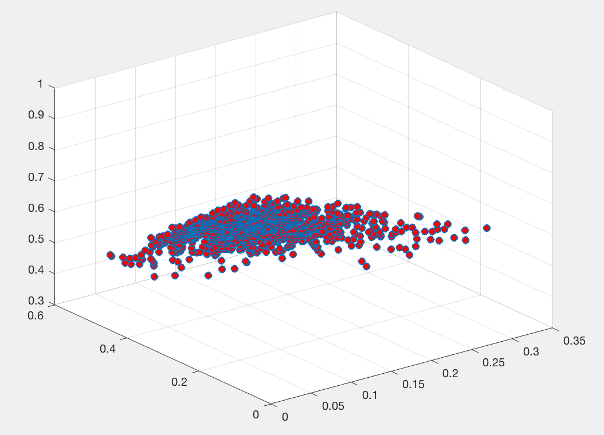
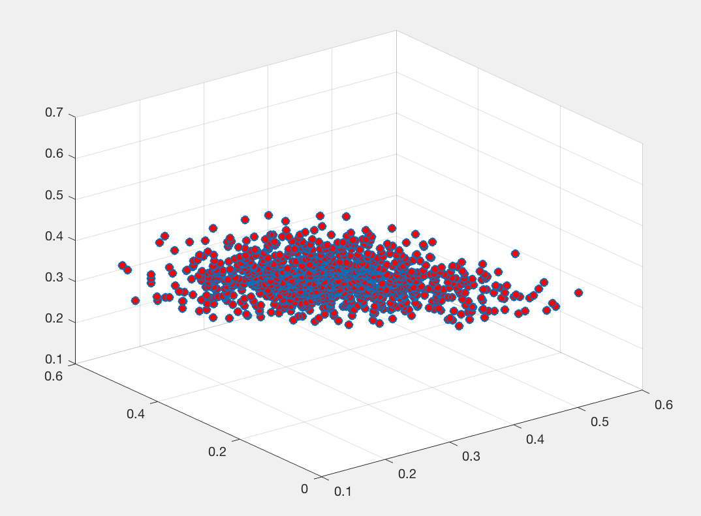

# Topic-Modeling

[](http://quantlet.de/index.php?p=info)

## [](http://quantlet.de/) **Topic Modeling** [](http://quantlet.de/d3/ia)

```yaml


Name of Quantlet: Topic Modeling

Published in: Dynamic Topic Modeling for Cryptocurrency Community Forums. 

Description: Plots of Dirichlet distribution.

Keywords: Dirichlet, distribution, density plots.

Author: Ernie Teo

```






```r

function r = drchrnd(a,n)
p = length(a);
r = gamrnd(repmat(a,n,1),1,n,p);
r = r ./ repmat(sum(r,2),1,p);

a = [1 1 1];
n = 1000;
r = drchrnd(a,n);

HD=scatter3(r(:,1),r(:,2),r(:,3),'MarkerFaceColor',[1 0 0]);
direction = [1 0 0];
rotate(HD,direction,50)

```